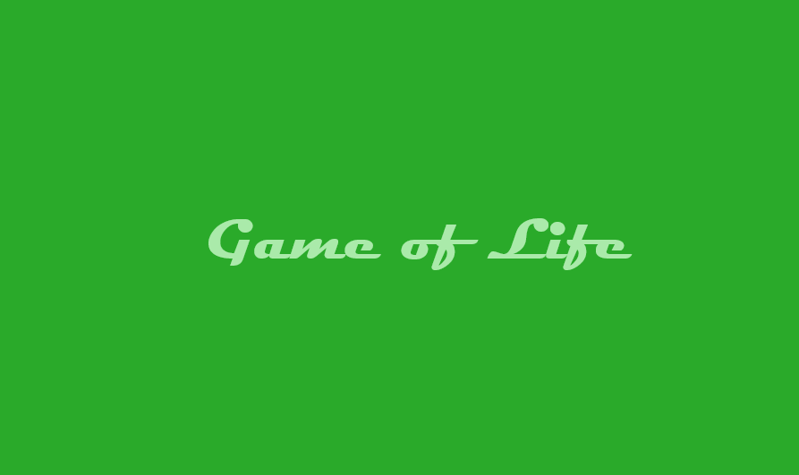

<div id="top"></div>

<!-- PROJECT SHIELDS -->
<!--
*** I'm using markdown "reference style" links for readability.
*** Reference links are enclosed in brackets [ ] instead of parentheses ( ).
*** See the bottom of this document for the declaration of the reference variables
*** for contributors-url, forks-url, etc. This is an optional, concise syntax you may use.
*** https://www.markdownguide.org/basic-syntax/#reference-style-links
-->

[![Contributors][contributors-shield]][contributors-url]
[![Forks][forks-shield]][forks-url]
[![Stargazers][stars-shield]][stars-url]
[![Issues][issues-shield]][issues-url]
[![MIT License][license-shield]][license-url]


<!-- PROJECT LOGO -->
<br />
<div align="center">
  <a href="https://github.com/iyyel/game-of-life">
    
  </a>

  <!-- <h3 align="center">Title</h3> -->

  <p align="center">
    <br />
    👽 Conway's Game of Life implemented in Scala 3 with Airstream and Scala.js
    <br />
    <!--
    <a href="https://github.com/othneildrew/Best-README-Template"><strong>Explore the docs »</strong></a>
    <br />
    <br />
    <a href="https://github.com/othneildrew/Best-README-Template">View Demo</a>
    ·
    <a href="https://github.com/othneildrew/Best-README-Template/issues">Report Bug</a>
    ·
    <a href="https://github.com/othneildrew/Best-README-Template/issues">Request Feature</a>
    -->
  </p>
</div>


<!-- TABLE OF CONTENTS -->
<details>
  <summary>Table of Contents</summary>
  <ol>
    <li>
      <a href="#about-the-project">About FIO</a>
      <ul>
        <li><a href="#built-with">Built With</a></li>
      </ul>
    </li>
    <li>
      <a href="#getting-started">Getting Started</a>
      <ul>
        <li><a href="#prerequisites">Prerequisites</a></li>
        <li><a href="#installation">Installation</a></li>
      </ul>
    </li>
    <li>
      <a href="#usage">Usage</a>
      <ul>
        <li><a href="#benchmarks">Benchmarks</a></li>
      </ul>
    </li>
    <li><a href="#performance">Performance</a></li>
    <li><a href="#license">License</a></li>
    <li><a href="#contact">Contact</a></li>
    <li><a href="#acknowledgments">Acknowledgments</a></li>
  </ol>
</details>


<!-- ABOUT THE PROJECT -->
## About The Project

<!-- [![FIO][product-screenshot]](https://github.com/iyyel/fio) -->

The Game of Life is a classic cellular automaton devised by John Conway. It consists of a grid of cells, each of which can be alive or dead. The state of each cell evolves over time based on simple rules:

Any live cell with two or three live neighbors survives.
Any dead cell with exactly three live neighbors becomes alive.
All other live cells die, and all other dead cells remain dead.

Despite its simple rules, the game can exhibit complex and fascinating patterns and behaviors such as a fully functioning computer or even the Game of Life itself.

This is an implementation of Conway’s Game of Life in Scala 3. It was primarily developed as a project to become acquainted with Scala 3, aiming to swiftly achieve a satisfying product ready for release. The finished product can be accessed here.

<p align="right">(<a href="#top">back to top</a>)</p>


### Built With

**FIO** is built using the following technologies:

* [F#](https://fsharp.org/)
* [.NET](https://dotnet.microsoft.com/en-us/)

<p align="right">(<a href="#top">back to top</a>)</p>


<!-- GETTING STARTED -->
## Getting Started

It is easy to get started with **FIO**.

### Prerequisites

* Download and install [.NET](https://dotnet.microsoft.com/en-us/)
* Download and install a compatible IDE such as [Visual Studio](https://visualstudio.microsoft.com/downloads/) or [Rider](https://www.jetbrains.com/rider/download/), or a text editor like [Visual Studio Code](https://code.visualstudio.com/)

### Installation

* Download or clone this repository
* Open it in your IDE or text editor of choice
* Navigate to the _Examples_ project and check out the example programs or create a new file to start using **FIO**

<p align="right">(<a href="#top">back to top</a>)</p>


## Usage

Create a new class and import the library using "open FSharp.FIO". For example:

```fsharp
open FSharp.FIO

[<EntryPoint>]
let main _ =
  let askForName =
    fio (fun () -> printfn "%s" "Hello! What is your name?")
    >> fun _ ->
    fio (fun () -> Console.ReadLine())
    >> fun name ->
    fio (fun () -> printfn $"Hello, %s{name}, welcome to FIO!")

  let fiber = Advanced.Runtime().Run askForName
  let result = fiber.Await()
  printfn $"%A{result}"
```

<p align="right">(<a href="#top">back to top</a>)</p>

<!-- LICENSE -->
## License

Distributed under the MIT License. See [LICENSE.md](LICENSE.md) for more information.

<p align="right">(<a href="#top">back to top</a>)</p>


<!-- CONTACT -->
## Contact

Daniel Larsen (iyyel) - [iyyel.io](https://iyyel.io) - [hello@iyyel.io](mailto:hello@iyyel.io)

<p align="right">(<a href="#top">back to top</a>)</p>


<!-- MARKDOWN LINKS & IMAGES -->
<!-- https://www.markdownguide.org/basic-syntax/#reference-style-links -->
[contributors-shield]: https://img.shields.io/github/contributors/iyyel/fio.svg?style=for-the-badge
[contributors-url]: https://github.com/iyyel/fio/graphs/contributors
[forks-shield]: https://img.shields.io/github/forks/iyyel/fio.svg?style=for-the-badge
[forks-url]: https://github.com/iyyel/fio/network/members
[stars-shield]: https://img.shields.io/github/stars/iyyel/fio.svg?style=for-the-badge
[stars-url]: https://github.com/iyyel/fio/stargazers
[issues-shield]: https://img.shields.io/github/issues/iyyel/fio.svg?style=for-the-badge
[issues-url]: https://github.com/iyyel/fio/issues
[license-shield]: https://img.shields.io/github/license/iyyel/fio.svg?style=for-the-badge
[license-url]: https://github.com/iyyel/fio/blob/main/LICENSE.md
<!-- [linkedin-shield]: https://img.shields.io/badge/-LinkedIn-black.svg?style=for-the-badge&logo=linkedin&colorB=555
[linkedin-url]: https://linkedin.com/in/ 
[product-screenshot]: images/main_menu.png
-->
