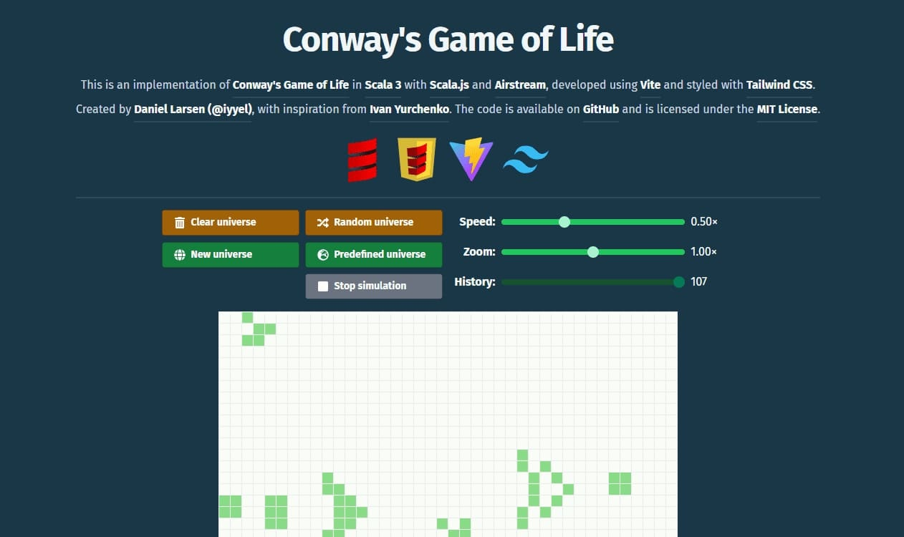

[![Contributors][contributors-shield]][contributors-url]
[![Forks][forks-shield]][forks-url]
[![Stargazers][stars-shield]][stars-url]
[![Issues][issues-shield]][issues-url]
[![MIT License][license-shield]][license-url]

 

  

  

     
    👽 Conway's Game of Life implemented in Scala 3 with Airstream and Scala.js
     
  

## Table of Contents
- [Table of Contents](#table-of-contents)
- [Introduction](#introduction)
- [Built With](#built-with)
- [Getting Started](#getting-started)
- [Usage](#usage)
- [License](#license)
- [Contact](#contact)
- [Acknowledgments](#acknowledgments)

## Introduction

The [**Game of Life**](https://en.wikipedia.org/wiki/Conway%27s_Game_of_Life), created by [**John Conway**](https://en.wikipedia.org/wiki/John_Horton_Conway), is a well-known cellular automaton. It features a grid of cells where each cell can either be alive or dead. The evolution of each cell's state over time is determined by straightforward rules:

A live cell with two or three live neighbors continues to live. A dead cell with exactly three live neighbors becomes alive. All other live cells die, and all other dead cells stay dead.

Despite its simplicity, the game can produce intricate and captivating patterns and behaviors, including a fully functional computer or even another instance of the **Game of Life**.

Here is a Scala 3 implementation of **Conway’s Game of Life**. This project was developed mainly to get familiar with Scala 3, with the goal of quickly producing a polished and releasable product. You can access the completed project [here](https://life.iyyel.io/).

**DISCLAIMER:** The user-interface may not work equally well on all devices and screen sizes. Feel free to submit a PR if you have a fix :)

## Built With
This implementation of the **Game of Life** is built using the following technologies:

* [Scala 3](https://www.scala-lang.org/)
* [Scala.js](https://www.scala-js.org/)
* [Airstream](https://github.com/raquo/Airstream/)
* [Vite](https://vite.dev/)
* [Tailwind CSS](https://tailwindcss.com/)

## Getting Started

* Download and install [Scala 3](https://www.scala-lang.org/)
* Download and install a compatible IDE such as [IntelliJ IDEA](https://www.jetbrains.com/idea/download) or a text editor like [Visual Studio Code](https://code.visualstudio.com/) (requires Metals extension)

## Usage

* Download or clone this repository
* Open it in your IDE or text editor of choice
* Open a terminal and enter `npm install` then `npm run dev` (open the localhost link)
* Open another terminal and enter `sbt` followed by `~fastOptJS`

Play around with the **Game of Life**!

## License
Distributed under the MIT License. See [LICENSE.md](LICENSE.md) for more information.

## Contact
Daniel Larsen (iyyel) - [iyyel.io](https://iyyel.io) - [me@iyyel.io](mailto:me@iyyel.io)

## Acknowledgments
Ivan Yurchenko - [https://ivanyu.me](https://ivanyu.me/) - [github](https://github.com/ivanyu)

<!-- MARKDOWN LINKS & IMAGES -->
[contributors-shield]: https://img.shields.io/github/contributors/iyyel/game-of-life.svg?style=for-the-badge
[contributors-url]: https://github.com/iyyel/game-of-life/graphs/contributors
[forks-shield]: https://img.shields.io/github/forks/iyyel/game-of-life.svg?style=for-the-badge
[forks-url]: https://github.com/iyyel/game-of-life/network/members
[stars-shield]: https://img.shields.io/github/stars/iyyel/game-of-life.svg?style=for-the-badge
[stars-url]: https://github.com/iyyel/game-of-life/stargazers
[issues-shield]: https://img.shields.io/github/issues/iyyel/game-of-life.svg?style=for-the-badge
[issues-url]: https://github.com/iyyel/game-of-life/issues
[license-shield]: https://img.shields.io/github/license/iyyel/game-of-life.svg?style=for-the-badge
[license-url]: https://github.com/iyyel/game-of-life/blob/main/LICENSE.md
[product-screenshot]: images/conways.jpg
